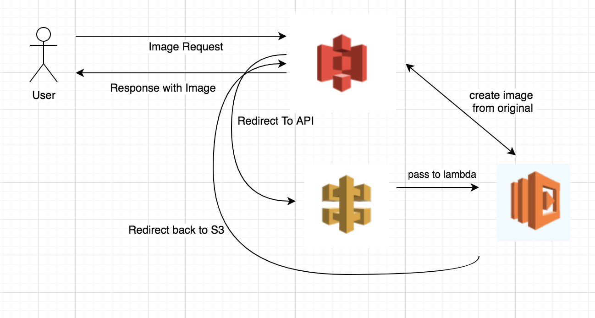

AWS Image Server POC
====================

This project is an example of a JS (AWS)
[Lambda](https://aws.amazon.com/lambda/) exposed with [API
Gateway](https://aws.amazon.com/api-gateway/), configured with
[Terraform](https://www.terraform.io/).


## Introduction

This demo project creates an S3 bucket. If a requested image size isn't available then the
404 is caught and redirected (307) to a `/resize` endpoint supporting any methods in AWS.
These are bound to a JS project containing an handler (a.k.a. lambda functions).
This is defined by a `handler`parameter. The code the lambda function is written in JavaScript.
The function transforms an image into another file type or size and saves the new image in the S3 bucket.
Finally the request is redirected to back to the S3 bucket to return the new image to the user.



The [Terraform file](main.tf) relies on two modules: [`lambda`](lambda/) and [`api_method`](api_method/).
This configuration creates a lambda functions on AWS Lambda, a (deployed) REST API with a single endpoint
and a S3 bucket, and takes care of the permissions and credentials.

## Getting started

You must have an [AWS account](http://aws.amazon.com/), create a user for the terraform to use.
Next, you must [install Terraform](https://www.terraform.io/intro/getting-started/install.html).

Clone this repository, update the variables.tf to set the bucket name and aws region, then run:

```
    # to setup your AWS login details
    aws creditials

    # to create a zip containing the JS code
    ./build.sh

    # to create the Infrastructure
    terraform init
    terraform plan
    terraform apply
```

You can destroy all the components by running:

    $ terraform destroy

For more information, please read [the Terraform
documentation](https://www.terraform.io/docs/index.html).
